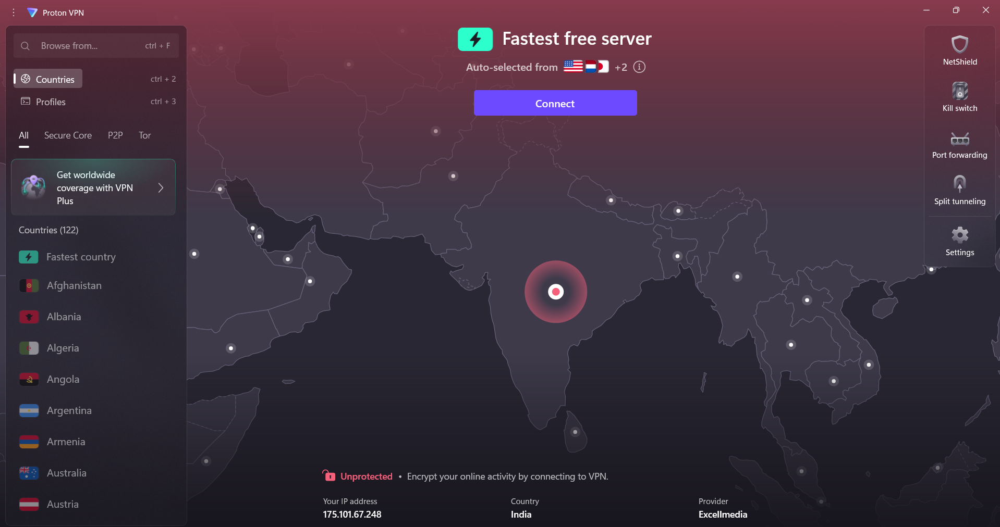
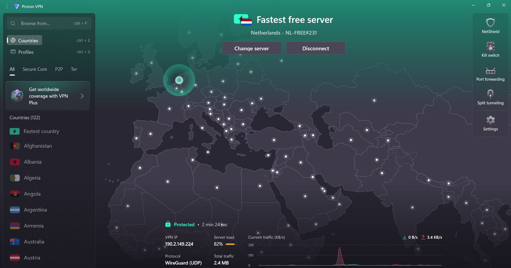
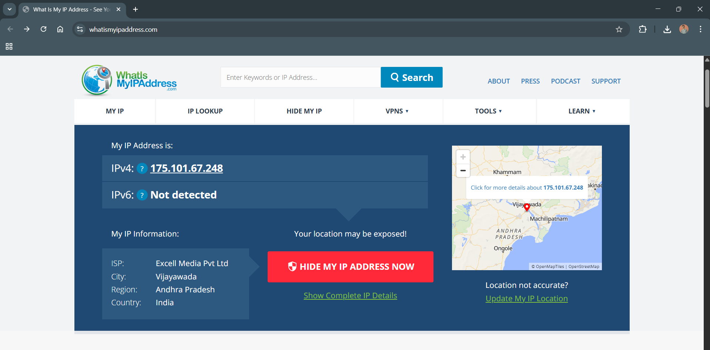
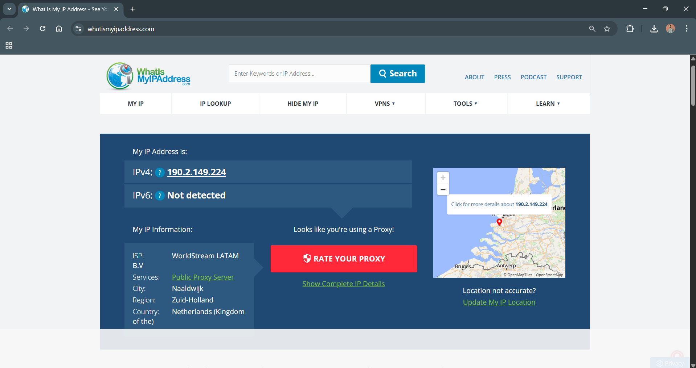
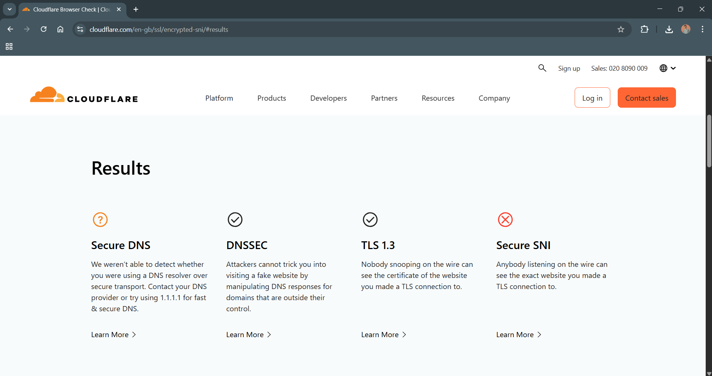

# Task 8 — Working with VPNs

## Objective
Gain hands-on experience with VPN setup, verify IP/geo change, and understand how VPNs impact privacy, encryption, and detection.

## Environment
- **OS:** Windows 11  
- **VPN:** ProtonVPN (Free tier)

## Steps Performed
1. Launched ProtonVPN and noted baseline (not connected).  
2. Captured **real IP** and geolocation before VPN.  
3. Connected to **Fastest free server – Netherlands (NL-FREE#231)** using **WireGuard (UDP)**.  
4. Verified **new IP**/location after connection.  
5. Ran Cloudflare’s browser encryption checks.  
6. Collected screenshots for evidence.

## Connection Details (from ProtonVPN UI)
- **Server:** Netherlands — **NL-FREE#231** (Fastest free server)  
- **Status:** **Protected**  
- **Protocol:** **WireGuard (UDP)**  
- **VPN IP:** **190.2.149.224**  
- **Server load:** **82%** at the time of capture  
- **Session shown:** ~**2 min 24 sec** connected

---

## VPN Connection Status

**Not Connected:**  
  

**Connected:**  
  

---

## IP Verification (Before vs After)

**Before VPN:**  
  
- IP: **175.101.67.248**  
- ISP: **Excell Media Pvt Ltd**  
- Geo: **Vijayawada, Andhra Pradesh, India**

**After VPN:**  
  
- IP: **190.2.149.224**  
- ISP: **WorldStream LATAM B.V**  
- Geo: **Naaldwijk, Zuid-Holland, Netherlands**  
- Note: Site flags this as **“Looks like you’re using a Proxy!”** — common for well-known VPN exit IP ranges.

**Conclusion:** The VPN successfully masked the real IP and shifted apparent location from **India → Netherlands**.

---

## Browser Encryption Checks
  

From Cloudflare’s browser test:
- **Secure DNS:** *Not detected* (browser test couldn’t confirm DNS-over-HTTPS/TLS).  
- **DNSSEC:** **✅ Enabled** (domain records validation supported).
- **TLS 1.3:** **✅ Supported** (modern encrypted transport in use).
- **Secure SNI:** **❌ Not secure** (no Encrypted ClientHello/ESNI on this path).  

---

## What These Results Mean
- **Privacy:** Your local ISP and nearby attackers see only an encrypted tunnel to ProtonVPN, not the final sites you visit.  
- **Geo-presence:** Websites now see a **Netherlands** IP, not your Indian IP. Some services detect/label VPN ranges, which can trigger CAPTCHAs or blocks.  
- **Encryption:** Transport security (TLS 1.3) is modern; DNSSEC helps integrity. Browser-level Secure DNS/ECH aren’t guaranteed by the VPN and may vary by browser settings.

---

## Benefits & Limitations Observed

**Benefits**
- Real IP masked; location shifted successfully.  
- All traffic tunneled and encrypted between device ⇄ VPN server.  
- Modern TLS (1.3) confirmed by browser test.

**Limitations**
- Browser didn’t show Secure DNS/ECH; these depend on browser/OS config and site support.  
- Exit IP flagged as proxy/VPN on some services.  
- Server load (82%) can impact performance during peak times (free tier constraint).

---

> Task completed as part of Elevate Labs Cyber Security Internship Program.
